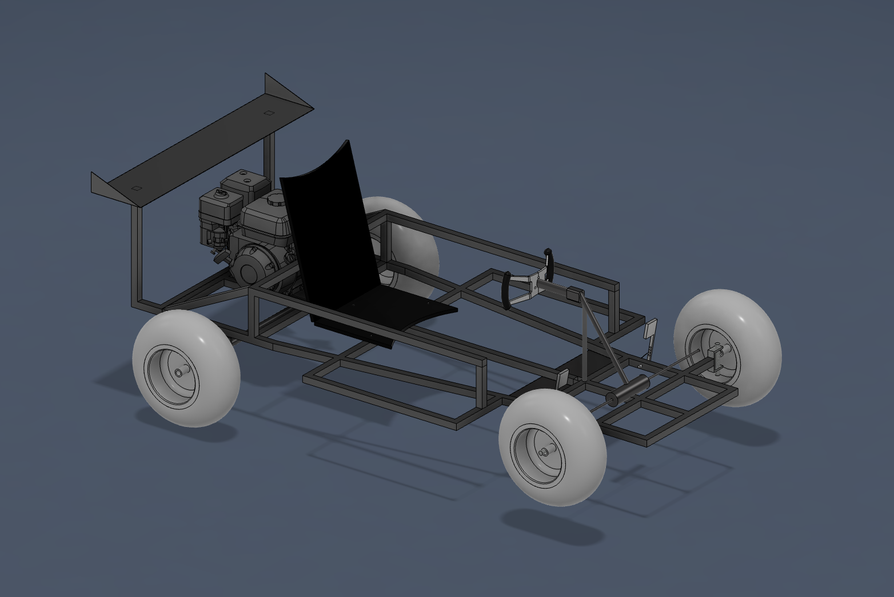
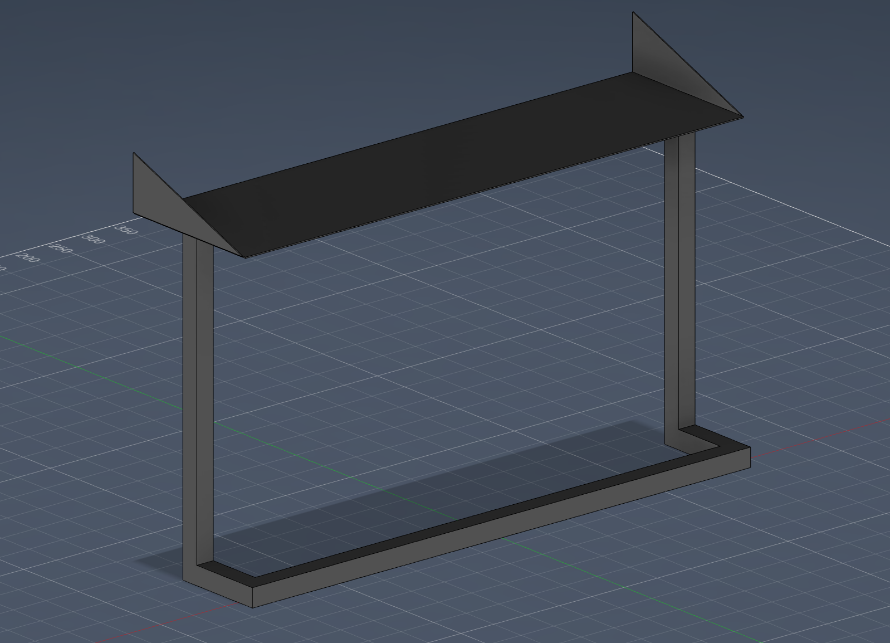

# Speedy-Go-Kart
A custom go-kart powered by a predator 212cc engine designed to go 25mph+. This design can be made with or without a roll cage or spoiler depending on your budget, and how you want to make it. The spoiler is just for aesthetic because the kart will go too slow for it to matter, and you cannot have both a spoiler and roll cage. It doesnt fit. 

## What Will It Do?
The goal for this desing, is a safe go kart that can go 25mhp that I can use. The getting to 25 mph is one of the things that makes it very expensive, because parts have to be strong enough to withstand that high of speeds. Because of that, each part is safe to go all the way up to at least 30 mph, just to be safe. The top speed is achieved through strength of motor (212cc going 3200rpm), wheel size, and gear ratio. This design can easily go faster, by changing the gear ratio from 12 and 72 teeth to anything smaller than 72 teeth on the rear axle sprocket. 

This will be a go-kart that can go on any terrain, because of all terrain tire, but I will use it primarly on pavement, but keep in mind, the tire will degrade faster on pavement than off road/dirt trails. If you use this on pavement, it will be a more bumpy ride, and there are few things you should know. Because of the all terrain wheels, on turns make sure to go much slower, so they don't burn out, or flip the kart. Also, brake more gradually, because with the wheels being all terrain, they can burn out very quickly if you constantly are braking very hard. 

Quite simply, it is a go kart that is fully custom, a diy build, that was designed by a teenager. 

# Building It Step by Step
This is just a guid for putting together the kart, but keep in mind I haven't done it yet, so more info is soon to come. 
#### 1. Buy the parts list
You can buy the parts directly of the link in the BOM, but if you know of any other (cheaper or better) options, make sure they are compatable, but feel free to add those. Try to find low shipping (I chose ones with the least I could find, but you can look yourself if you want), so you can reduce the total price.
#### 2. Review and Cut the Steel
I have a list of all of the steel tubing cuts that you will have to cut out, in order for you to be to weld them later. This is located in the file named "Steel to Cut", so look their for the whole list. The purpose of this step is that before you weld, you can have every piece cut to length, so you don't have to worry about it later. You don't have to weld it right away after you cut it, and you can do the next step before. Make sure to store your metal somewhere safe (you don't want to have to buy more if it gets stolen).
#### 3. Assemble Components
What I mean by this, is put together the live axle kit, put the torque converter together and on the motor, and make sure your steering is properly put together. This is for the same reason as the previous one, you want to make welding as easy as possible, so having all of the parts put together beforehand is crucial. One thing to know, is don't put the wheels on the spindles yet, because they will be welded on first. Also, when assembling the live axle kit, don't connect the bearing hangers, because those will be welded on, and you will screw on the bearing after. Another thing that you will have to do, is connect the tires to the rims, and blow them up to the described psi. You can find the psi on the website that you bought the tires from. Keep in mind these are tubless tires, so you will not need a tube for them, but the connection has to be perfect, because you don't want any air to leak out while riding. 
#### 4. Weld the Frame
This is an important part, because the frame has to be robust and sturdy, so that everything works well. What you now need to do, is pull out all the metal that you cut previously. You will then get your 4x8 of plywood, and nail down the metal (put nails on both sides so that it is held in place) in the shape of the frame. Review the metal cutting list for information for where each piece goes before nailing it down. At this point, don't worry about the handrails. Now that you have the frame nailed down in its shape, make sure that all of the connections are in the right places. That is very important to do before you weld.

You will then tac weld the frame together at each connection point, so that the frame can be held together by itself, without the need of the nails. You then need to properly weld each portion of the frame together, very securly, so that it won't break while riding. Try to avoid warping while you are welding it, considering that it is a pretty thin metal. 
##### Hand Rails
For the hand rails, you will use the same process as the whole frame to first weld together the two handrail for each side. Then, after you have both of the handrails seperatly, you will weld it onto the frame. I honestly don't know the best way to do this, but I assume that you hold it securly with one hand, and tack weld the connection with the other hand, for both connection points. Then you complete the weld on the connection, like on the frame. 
#### 5. Weld Other Parts
There are a few other parts that you will need to weld on, before assembling. For example you will need to weld on the bearing hangers, steering support rod, motor mounting plate, feet plate and the wheel spindles. For the spindles, you can choose how high up on the metal tube you want it, but I suggest welding it straight on putting the wheels as close as possible to the ground to match with the back wheels. This is because when you weld on the bearing hangers, you need to weld it so that it connects to the back of the kart, but it will extend beneath the go kart frame. You can see the CAD of the hangers, but the spindles are just put in the middle. If you want less of an angle from back to front, then you need to put the spindles lower. Then you need to weld on the motor mounting plate as shown in the CAD, making sure that it won't hit the support beam from the handrails, as well as being able to have the torque converter and 72 tooth sprocket line up and connect. For the support steering rod, you will have to review the CAD to get the exact distance away from the front that you need to weld it on, but it is just one rod, so it won't be a difficult weld. For the metal plate for your feet, you will have to cut it down to 20x6 in, so it fits perfectly for the length of the kart, the weld it on the BOTTOM. This is because then your feet will rest there, and have the actual beam so they don't go too far forward. 
#### 6. Add on Components
Now that you have the whole entire frame done, and the spindles/bearing hangers/support beam added, you can add on the components. This includes putting the wheels on the spindles, connecting the steering tie rods to both spindles, and threading it through the bearing on the support beam. Then, you will screw on the bearing to the bearing hangers for the back wheels. You also need to add the pedals. You need to measure the distance you want your pedals to be from where you are sitting, then drill a hole in the frame for the pedal bolt to go through. You will then need to weld on a metal tab (extra from the 5/8 in metal support beam for the steering mechanism), for the spring to connect to. You need to make sure that there is resistance as you push down the pedal, and that it will pop right up after wards. You need to then connect the cables for the brake and thottle to the engine, and brake pads. You can thread these around your frame using zip ties, ensuring that the casing is stable. You also have to add on the stearing wheel, and connect it to the rack and pinion setup, so you can actually turn the kart. 
##### Seat
The next part is adding on the seat. You can make the seat using the plywood you used for the welding, and screw it together, which is the cheap option, or you can get another seat that you have and screw it on. Either way works. You just need to screw it into the metal frame, and the best way to do this is using self tapping screws. This makes it so you don't need a bolt on the back end, because it threads itself as it goes. 
### 7. Turn it on and have Fun!
Hopefully at this point it will all be together very robustly. The goal is for you to be able to turn on the engine, get inside, and ride around using this setup.
Be safe and have fun. 

* This is just the standard process for building the go-kart, if there are any other problems that occur, I will deal with them as they come and let you know. More details will come when I build it myself. 

# Roll Cage
The roll cage is an optional addition that you can add onto your go kart if you want. I personally will not be, but I designed it so if you want, you can, and it will fit the kart. This is a simple design for the roll cage that allows enough room over your head to be comfortable, but isn't too high. This is made out of 1 1/4 in steel tubing, but unlike the frame, it is round tubing rather than square tubing. This is completely optional, and can function just fine with or without it. I would recomend it if your are going all terrain, or if you will be racing or doing something like that, but if it will be used for something, then you will be fine without it. 

### Instructions for Building the Roll Cage
This is only if you are adding the roll cage into your build, which I am not, so I'm sorry if the instructions aren't as good as they should be. 
#### 1. Buy Metal
You need to buy 1.25in 11 gauge metal to fit your kart. In the metal cuts foler I will have the exact amounts and distance that you need all recorded. This will also tell you where each part will go. 
#### 2. Bend Metal
For the roll cage, there are 6 pieces of metal that you will have to bend to make the whole thing stronger. The reason why you bend the metal rather than just doing welds, once you bend it, it changes it's properties, and is less likely to bend again (in a crash). The six pieces will be bend according to the CAD, so review the CAD before bending. The pieces that you need to bend will be shown in the Roll Cage metal cuts folder, but they are the ones that connect to the frame, and the very top piece. The only ones that you don't need to bend are the straight pieces that connect the bent pieces. 
#### 3. Weld the Cage
You will start by using the same plywood method as for the frame, but this time it is with round tubing. This shouldn't change anything, but it might make it a little bit harder. You need to first weld the two sides seperatly, and you should see the shape of the cage forming after you weld it. To give it it's actual shape, you need to then weld on the 3 support beams that connect the two sides. This might be the hardest part, because you need to keep both sides of the frame perfectly straight while you tack weld on the 3 beams, then you will fully weld them on after. It might be necessary to have people holding up the frame for you while you weld. 
#### 4. Weld it onto the Frame
This should be the last part of the process, and shouldn't be too hard. Because you now have the whole roll cage welded, you just need to put it over the completed go kart, and weld it on. It should be in place just by putting it on, then you will tack weld each connection point, the fully weld it after wards. After this, you should be set to go. 

I am sorry if this isn't detailed enough, I am not building it myself, so let me know if there is anything you would do differently. 

### Instructions for Building the Spoiler. 
This is the spoiler for the go kart. This cannot be used if you are using the roll cage (it wouldn't fit). Keep in mind this had no actual value for aerodynamics or anything unless you are going 50+ (which this kart is only going 30). It is mainly just for aesthetic. I will not actually be building this myself, so I hope the instructions are clear. 

#### 1. Buy the metal
So, you will need two different types of metal. 16 gauge steel plating, and 14 gauge steel square tubing 1". Review the metal cut document for the exact amount you need. 

#### 2. Cut the metal
You can review the metal cut section for the exact dimensions, but you need to have each of the 14 gauge steel tubing pieces be cut before you start.

#### 3. Weld the spoiler. 
The best way to do this is to start with 1 one of the perpendicular connections (the piece that connects onto the frame, and the one going up). You will start by welding together the two seperate "L"s. Then you will weld those two pieces onto the frame. You will position these at the very edge of each side of the frame, with the long side of the L pointing up. Then you will weld on the 38x8 in 16 gauge steel plate on top of those two beams, with the beams, with 4 inches sticking out on each side of the brackets. 

#### 4. Add the Triangles. 
Because this spoiler is mainly just for aesthetic, you probably should add the triangles, but it isn't necessary. You just have to cut out two triangles that are 8 inches long out of the steel 16 gauge plating, then any height. Then you weld on the traingles to the 16 gauge steel plating for the spoiler. 

* 16 gauge steel is very thin, so be careful while welding to avoid burning through.

### How to Actually use the Go-Kart
The first step of actually using the go-kart, is putting it to your exact dimensions. This means you have to adjust the seat to fit your height, by drilling holes into the frame where you want your seat to go, and screwing the seat in. This go-kart isn't designed for someone above 6 feet tall, (keep in mind I am 14, and didn't need that) but you can drill the seat in anywhere else along the middle bar in the frame. 

#### Turning it On, and Using it
This might be a little self explanitory, but you would first make sure that there is enough gas and oil in the motor, then you start the engine. This will idle the motor, and won't move because of the torque converter, so to actually move, you will have to press on the pedals. The right pedal should connect to the throttle on the motor (using a throttle cable) and the farther you press down the pedal, it should open up the throttle more and more. It is the opposite for the brake cable, because you would put it on the left pedal, and it should pull on the mechanical disc brake, which closes the pads on the actual disc to slow it down. To turn the motor off, you can turn of the power on the engine. 

Those are the basic practices used to start and stop the go kart. 

## Mentorship
For my design, it requires me to know how to weld, and to make sure that my design is stable, and robust. So, after making my orignial design, I reached out to an engineer to have him work with me and mentor me on how to make it better. He reviewed my design to ensure that it can withstand high speeds, and function properly. His overal opinion was that it was originally a good design, but to make it even better there were a few things that I could do. For example, he advised adding more triangles and support at a different plane, because currently the design was pretty 2 dimensional for the frame, excluding the handrails. So we talked about ways that I could do that, and we decided that if we added supports from the handrail that attached diagonally to the back of the frame, it would make it a lot stronger. Also, we reviewed which pieces I had put on the original frame, and ended up removing excess support.  

#### Welding
I have never welded, and quite simply, didn't know how they worked. So I did some research to understand the different welds and different types of weldes, and even what a tack weld was. One big problem, is that I don't have a welder myself, but fortuatlly, a lot of my neighbors do. Also, recently I was told that my dad might get a welder, and for that reason I started to research welders. I talk more about that below. But, I have a neighbor that I reached out to, and he said that he would definitly teach me how to weld, and that I could come over anytime. Another benefit is that he has the perfect type of welder, and scrap metal to practice on. Even if my family gets a welder, I might still do it with the neighbor, because he can teach and mentor me as we go. 

Also, I designed an extension to the handlebar (which you will be able to find in images) as well as a sprocket protector (optional) because I realized that it might not be close enough to the driver while going.

# Understanding CAD Files
I organized the CAD files in the repository how I would understand, but this is if you are confused about it. NOTICE: Identical files might be in two different places, as long as they fit the criteria of the folder. 

I organized the files by:
1. All together (in no folders for ease of access if you know what you want)
2. .STEP Files/.F3d/z Files
3. Chassis Designs (Only the frame, and steering wheel, no wheels, motor and torque converter)
4. Assembly Designs (The whole go kart put together with wheels and everything) There will be roll cage and no roll cage options. 
5. Steering Wheel (The actual wheel)
6. Wheels (not identical to the real ones, just the CAD ones)
7. Propulsion (Torque converter, Predator 212cc motor)
8. Roll Cage
9. Spoiler
10. Other

I am curious to what the files look like when you dowload them, because I just have them in my computer. In my design I have hidden some bodies and components that I am not using anymore, because I added new ones to take their place. I don't know if when you download the files if they will un-hide the components, so if there are wheels inside of wheels, or a bad steering wheel inside of the new steering wheel, sorry. My fault gang. 

Here is the list of bodies that you will need to hide if you want it to look like the pictures that I have shown:
Chassis -
Body 22 (Old steering wheel)
Body 39,40,41, 42 (Four makeshift wheels that aren't at all accurate, I just put them it earler to make it look like a go kart before I made an assembly)

Assembly - 
Go kart design folder - Body 22 (Old steering wheel)
Go kart design folder - Body 39,40,41, 42 (Four makeshift wheels that aren't at all accurate, I just put them it earler to make it look like a go kart before I made an assembly)

Butterfly steering wheel design folder - Body 3. This is the 5 inch spacer that I design in the butterfly file, and it transfered over to the assembly. Right now it isn't lined up correctly, so it will look like it is intersecting with the rack and pinion steering. 

*I will have file names say either chassis, or assembly (as dictated above) for any of the actual full go kart designs, and other components will be marked by their names. The steering wheel is called a butterfly steering wheel (just so you know). 

#### Steel Tube Caps
For this design, there might be some exposed tubing, that debris might be able to get into. I designed a steel tube cap that you can 3d print and put in any exposed holes in the tubing, to look better, and not let any debris in. You can find an image in the image folder, and the CAD in its file. 

### Steering Wheel
For the steering wheel, (for the provided CAD) there is something that you must know. When you 3d print it, you should print the spacer and wheel seperatly, so you can adjust based on the size of the rider. Also, this is very important, when you 3d print it, it NEEDS to be on high infill, because there is a lot of stress on the connection points between the handle and middle, and they are pretty thin, so make sure that it is high infill (and a good pattern). If you don't, then it will break. (I learned that the hard way)

## Welding Analysis
So, for those of you who don't have a welder, and are looking to purchase one, you're in luck. For this project, I did an analysis on the different types of welders, and their pros and cons, and how they work. You should definitely review this before welding, so you know which type of welder to use as you go. I think that the only real "wrong option" is stick welding, so if you have one of those, I wouldn't use it here, because it would burn through the 14 gauge metal. Review the document for a better understanding of welders, and it also provides some links to welders, and face masks. 

My overall opinion is that for this project MIG gas shielded, or flux core welding would work well, but maybe MIG gas a little better. If you want to have lots of options though, I would get the multi-process welders. 

# BOM (No spoiler/roll cage)
| Item                                                | Unit Price                                                                                                                                                                                          | Quantity        | Total Price | URL                                                                                                                                                                                                                                                                                                                                                                                                                                                                                                                                                                                                                                                                                                                                                                                                                                                                                                                 |   |   |   |   |   |   |   |   |   |   |   |   |   |
|-----------------------------------------------------|-----------------------------------------------------------------------------------------------------------------------------------------------------------------------------------------------------|-----------------|-------------|---------------------------------------------------------------------------------------------------------------------------------------------------------------------------------------------------------------------------------------------------------------------------------------------------------------------------------------------------------------------------------------------------------------------------------------------------------------------------------------------------------------------------------------------------------------------------------------------------------------------------------------------------------------------------------------------------------------------------------------------------------------------------------------------------------------------------------------------------------------------------------------------------------------------|---|---|---|---|---|---|---|---|---|---|---|---|---|
| Predator 212cc Engine                               | $149.99                                                                                                                                                                                             | 0 (Already Own) | 0           | https://www.harborfreight.com/65-hp-212cc-ohv-horizontal-shaft-gas-engine-epa-69730.html                                                                                                                                                                                                                                                                                                                                                                                                                                                                                                                                                                                                                                                                                                                                                                                                                            |   |   |   |   |   |   |   |   |   |   |   |   |   |
| "Wheels (set of 4)"                                                   | $85.25                                                                                                                                                                                              | 1               | $85.25      | https://www.ebay.com/itm/176099625588?chn=ps&mkevt=1&mkcid=28&google_free_listing_action=view_item                                                                                                                                                                                                                                                                                                                                                                                                                                                                                                                                                                                                                                                                                                                                                                                                                  |   |   |   |   |   |   |   |   |   |   |   |   |   |
| Engine Mounting Plate                               | $15.99                                                                                                                                                                                              | 1               | $15.99      | https://www.walmart.com/ip/JRL-Motor-Mount-Plate-Kit-Harbor-Freight-Predator-For-212cc-Engine-Motor-Mount-Plate-Kit-6-5HP-Go-Kart/1553238911?wmlspartner=wlpa&selectedSellerId=101089297&sourceid=dsn_gdn_0c92c416-dbd6-42ec-845c-ecf69af2153d&veh=dsn&wmlspartner=dsn_gdn_0c92c416-dbd6-42ec-845c-ecf69af2153d&cn=0042_fy27_mp_mpa_lo_int_dis_pmax-p13n&wl9=pla&wl11=online&gad_source=1&gad_campaignid=23148469844&gbraid=0AAAAADmfBIoXduid9xVebSBss-DheVyZD&gclid=Cj0KCQjwxvjRBhC2ARIsAI7KJa0XVGTJpQ9IBYpJSrws2-USC56vp1eicbWI1ScslFUsFs36IVgfi4EaAsLbEALw_wcB                                                                                                                                                                                                                                                                                                                                                   |   |   |   |   |   |   |   |   |   |   |   |   |   |
| Back Wheel Rims                                     | $32.95                                                                                                                                                                                              | 2               | $65.90      | https://www.bmikarts.com/6-x-4-12-Wheel-1-Bore_p_5402.html?srsltid=AfmBOooIlNu_Fj9ncU-HA2ealPheeLQ-ESCZTJkuxEHGdD2GwwwJBvco                                                                                                                                                                                                                                                                                                                                                                                                                                                                                                                                                                                                                                                                                                                                                                                         |   |   |   |   |   |   |   |   |   |   |   |   |   |
| Front Wheel Rims                                    | $29.95                                                                                                                                                                                              | 2               | $59.90      | https://www.bmikarts.com/6-x-4-12-Floater-Wheel_p_1566.html?srsltid=AfmBOopctCR9zSRW-7UiEqR7UPV91Dgz5dZFub6JQFLrJp46ySObkHfECNE                                                                                                                                                                                                                                                                                                                                                                                                                                                                                                                                                                                                                                                                                                                                                                                     |   |   |   |   |   |   |   |   |   |   |   |   |   |
| Cable Clamp                                         | $12.99                                                                                                                                                                                              | 1               | $12.99      | https://www.amazon.com/Aiomhao-Throttle-Brake-Terminator-Coupler/dp/B0G34GSN6G/ref=sr_1_1_sspa?channelId=500&clpRedir=Y&dib=eyJ2IjoiMSJ9.4kPF_b97OCCdqHs9hwDdp4mtZ72hh2UOdCd63d1bKdNiZAAGBKb4sNOwU-4wjMQhVMOA-UIGRtns4nHhgjyyLXWOPVS-jqFG0BnJFYNf6hEov5TXw3xQJ9XR07ANYqFh25CPIgh7yP5VrqAFUxaecEfJXJwBLsuHdnZAOS6U-QmPmCa4zEOryXAZ2wTaeHvLdvTYNXL_d0SjoB7bFf8ayeMpdtDWMjsCu7A47GkVt0cg8rGvk2R7J8Iz2etmSWtXYpORe7zo2D6c8FlItgqOGYX70rmrAJg0pX-AYIvXi1Y.QrxS2KMsf5y4fRw180_NfhFJwapQx5XedOhyvNSx9sY&dib_tag=se&keywords=go+kart+throttle+cable+clamp&plpRedirect=mhFallback&qid=1783913728&sr=8-1-spons&sp_csd=d2lkZ2V0TmFtZT1zcF9hdGY&psc=1                                                                                                                                                                                                                                                                           |   |   |   |   |   |   |   |   |   |   |   |   |   |
| Brake Cable                                         | $7.95                                                                                                                                                                                               | 1               | $7.95       | https://www.bmikarts.com/Brake-Cable--65_p_5554.html                                                                                                                                                                                                                                                                                                                                                                                                                                                                                                                                                                                                                                                                                                                                                                                                                                                                |   |   |   |   |   |   |   |   |   |   |   |   |   |
| Torque Converter                                    | $58.89                                                                                                                                                                                              | 1               | $58.89      | https://www.amazon.com/GYMMEDS-30-Converter-Predator-Replacement/dp/B0D6Z6VG63/ref=sr_1_1_sspa?crid=3133TY01SKTOH&dib=eyJ2IjoiMSJ9.ljKYlKqXZERQAzG1RNVG8AVuFsXPdSsbrPIm_JkspUmd8iSGGi78oTry5wTGMqMt5ryOkl9ojFSnTmPHbbj0OI541ZoHTHUGk693SZgok6gisW_dK68JVzOmietuex-RrX2STIkJee-jkwbGjcqw3Tq8KqoUQ12Ml0NG2r73On1t9mDWnkVxhgGUgo6vo-qmrJgXxjvgpEtKvD9ZATsi33e6FAEbV7666q2pbkm6_6s.b56gUdk2MJ1c4lStVswb_qniQ2pKYpEFBxWjJpnZENQ&dib_tag=se&keywords=30%2Bseries%2Btorque%2Bconverter%2B%2335%2Bchain%2Bfor%2Bpredator%2B212&qid=1782590388&sprefix=30%2Bseries%2Btorque%2Bconverter%2B%2B35%2Bchain%2Bfor%2Bpredator%2B212%2Caps%2C170&sr=8-1-spons&sp_csd=d2lkZ2V0TmFtZT1zcF9hdGY&th=1                                                                                                                                                                                                                                  |   |   |   |   |   |   |   |   |   |   |   |   |   |
| Rear Live Axle + Brakes + Sprocket Kit              | $172.95                                                                                                                                                                                             | 1               | $172.95     | https://www.bmikarts.com/1-Live-Axle-Kit-35-Chain_p_44794.html?srsltid=AfmBOoqgqtjn9SSq9ierFu9jjqPi0PCzwxA0o21o8fqavQkBkc28IrQo                                                                                                                                                                                                                                                                                                                                                                                                                                                                                                                                                                                                                                                                                                                                                                                     |   |   |   |   |   |   |   |   |   |   |   |   |   |
| Pedals + Throttle Cable                             | $16.99                                                                                                                                                                                              | 1               | $16.99      | https://www.amazon.com/CILOYU-Pedals-Throttle-Accessorise-Predator/dp/B0CVWZQCHG/ref=sr_1_9?crid=3MRWGBGHM1HX8&dib=eyJ2IjoiMSJ9.Cc5KPbdUAvFZNWbnqUYqJB3BHKTsG53VWA-VoT80qg87l4D8qLAqPUc_FNOyQNyiBlnqqnvPvyad0Vm6HeQQEGGFbZFhopbcxUsJN4wkM4Ev7tDaiC4mPoiM1QlKlXVKCRhKjanxaFNcE53-x9VWqDYkUFU37q_qKSXS0XlvQ6_sNX3XWNje5viQ29DsqNwcabyYgg4OGmvS-1Sc19k4x2NJETgLcSRjEUezB1AJfwfj08haEl4DcJ1DiIxGlzvZu8X-9BTrCiMS2F6njMolHFlQfi60dz_gWfwh4f_IFLU.Tkjo4AA4SfwKwrq4MfA3gNbXVibMN6UE_J11I4JqTmw&dib_tag=se&keywords=go%2Bkart%2Bpedal%2Bkit&qid=1781379817&sprefix=go%2Bkart%2Bpedal%2B%2Caps%2C466&sr=8-9&th=1                                                                                                                                                                                                                                                                                                             |   |   |   |   |   |   |   |   |   |   |   |   |   |
| 16 Gauge 24x6 in steel to weld on for feet panel.   | $19.48                                                                                                                                                                                              | 1               | $19.48      | https://www.lowes.com/pd/Hillman-6-in-x-24-in-Cold-Rolled-Steel-Solid/3050431                                                                                                                                                                                                                                                                                                                                                                                                                                                                                                                                                                                                                                                                                                                                                                                                                                       |   |   |   |   |   |   |   |   |   |   |   |   |   |
| Steering Rod Support Shaft 20"                      | $16.14                                                                                                                                                                                              | 1               | $16.14      | https://www.amazon.com/YOXMULK-Stainless-Steel-Round-Length/dp/B0FSZWGGHW/ref=sr_1_15_sspa?crid=27GVEZOWVIFXV&dib=eyJ2IjoiMSJ9.ZsBWXZ079Nmlw-qHP2cy10DzHOnwMMbp4P2RK7krGuTWSoDtLLY5zofzGHtfJMfWidJmHJNL6eCCdhqmZ8IAjX754q9DC9fc8h1FfWM1FyRixOhypdH1O4EHo1RdEmcF4CX5c4J_7orqF8qDFi611EOhyiAY-MLOIAODwdN2rbN9VINnKiy4V9v4OCzvyFJdApLSjP5Bx4PUQi1ofWGhnXq068bj6Ch54gvawDyK59c.5418H2BzdvdiJcXeKIf69gmzhLtdStgD7K6V7XTm7Vw&dib_tag=se&keywords=5%2F8%2Bin%2Bsteel%2Brod%2B20%22&qid=1784246313&sprefix=5%2F8%2Bin%2Bsteel%2Brod%2B20%2B%2Caps%2C306&sr=8-15-spons&sp_csd=d2lkZ2V0TmFtZT1zcF9tdGY&th=1                                                                                                                                                                                                                                                                                                                   |   |   |   |   |   |   |   |   |   |   |   |   |   |
| Steering Shaft Support Bearing                      | $13.95                                                                                                                                                                                              | 1               | $13.95      | https://hotrodhardware.com/products/copy-of-borgeson-stainless-steel-rod-end-bearing-steering-shaft-support-1?variant=41648812261508&country=US&currency=USD&utm_medium=product_sync&utm_source=google&utm_content=sag_organic&utm_campaign=sag_organic&srsltid=AfmBOorkUpjoPpxZ5j67RJiSZ3wNLPVzU_H-WN81XD0TLoHUX36Dw3XKaFw                                                                                                                                                                                                                                                                                                                                                                                                                                                                                                                                                                                         |   |   |   |   |   |   |   |   |   |   |   |   |   |
| Rack and Pinnion Steering                           | $66.99                                                                                                                                                                                              | 0 (Already Own) | 0           | https://www.amazon.com/JNDO-Steering-Pinion-Column-Suitable/dp/B0FJ54SFKF/ref=sxin_18_pa_sp_search_thematic_sspa?content-id=amzn1.sym.f1e24090-399e-445e-b618-1765f1ce436c%3Aamzn1.sym.f1e24090-399e-445e-b618-1765f1ce436c&cv_ct_cx=rack%2Band%2Bpinion%2Bgo%2Bkart%2Bsteering&hvadid=812633937494&hvdev=c&hvexpln=67&hvlocphy=9029746&hvnetw=g&hvocijid=12344385032973254331--&hvqmt=e&hvrand=12344385032973254331&hvtargid=kwd-2419958675991&hydadcr=23359_13902220&keywords=rack%2Band%2Bpinion%2Bgo%2Bkart%2Bsteering&mcid=4b6269b2b7ba3d9ebca92a1b117f666a&pd_rd_i=B0FJ54SFKF&pd_rd_r=4a8e6695-34f7-483f-8a8f-c6a58c95837c&pd_rd_w=2mnxx&pd_rd_wg=XjdDa&pf_rd_p=f1e24090-399e-445e-b618-1765f1ce436c&pf_rd_r=P87G64RD5Z9B99QSKZHA&qid=1782508644&sbo=RZvfv%2F%2FHxDF%2BO5021pAnSA%3D%3D&sr=1-1-72da3c38-bbeb-4ec6-a5c8-94f3516831b3-spons&aref=rzdhgeWSJy&sp_csd=d2lkZ2V0TmFtZT1zcF9zZWFyY2hfdGhlbWF0aWM&th=1 |   |   |   |   |   |   |   |   |   |   |   |   |   |
| 1 Inch 14 Guage Steel Tubing 20'+1 Cut              | $36.75                                                                                                                                                                                              | 3               | $110.25     | https://www.wasatchsteel.com/buy-steel/                                                                                                                                                                                                                                                                                                                                                                                                                                                                                                                                                                                                                                                                                                                                                                                                                                                                             |   |   |   |   |   |   |   |   |   |   |   |   |   |
| 5/32 in 4'x8' Sanded Plywood for the Seat + welding | $11.48                                                                                                                                                                                              | 1               | $11.48      | https://www.lowes.com/pd/7-16-CAT-PS2-10-OSB-Sheathing-Application-as-4-x-8/50382768                                                                                                                                                                                                                                                                                                                                                                                                                                                                                                                                                                                                                                                                                                                                                                                                                                |   |   |   |   |   |   |   |   |   |   |   |   |   |
| Spindles 5/8 inch bearing                           | 39.99                                                                                                                                                                                               | 0 (Already Own) | 0           | https://www.ebay.com/itm/286022214149?chn=ps&norover=1&mkevt=1&mkrid=711-173151-913341-5&mkcid=2&mkscid=101&itemid=286022214149&targetid=2449372253943&device=c&mktype=pla_with_promotion&googleloc=9029746&poi=&campaignid=21214302385&mkgroupid=189125629192&rlsatarget=pla-2449372253943&abcId=9407524&merchantid=118831248&gad_source=1&gad_campaignid=21214302385&gbraid=0AAAAAD_QDh-MjHwTjZ94hqtVOdR8B80ZB&gclid=CjwKCAjw9szSBhBNEiwAC57Sqzv--DehM_jUqeIb6b_qp1d2G2JB_2Dd_DIjbxV5AlN47WscSkhWRxoCAnMQAvD_BwE                                                                                                                                                                                                                                                                                                                                                                                                  |   |   |   |   |   |   |   |   |   |   |   |   |   |
|                                                     |                                                                                                                                                                                                     |                 |             |                                                                                                                                                                                                                                                                                                                                                                                                                                                                                                                                                                                                                                                                                                                                                                                                                                                                                                                     |   |   |   |   |   |   |   |   |   |   |   |   |   |
| Total Price (tax+shipping) estimate: 726.66         | *Note, for the steel I am using a local vendor. Prices may vary for other vendors. Also, parts may seem very expensive, but for traveling at high speeds, these are the cheapest that I could find. |                 |             |                                                                                                                                                                                                                                                                                                                                                                                                                                                                                                                                                                                                                                                                                                                                                                                                                                                                                                                     |   |   |   |   |   |   |   |   |   |   |   |   |   |

## Overview
This project has really made me improve in a lot of skills, such as CAD, and understanding vehicles. This has been a learning experience for me, because I have never actually done something like this, and usually I only do sports. Review the License to know how to use this info. 

